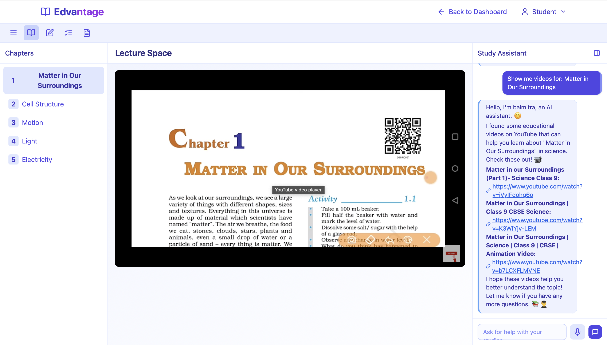
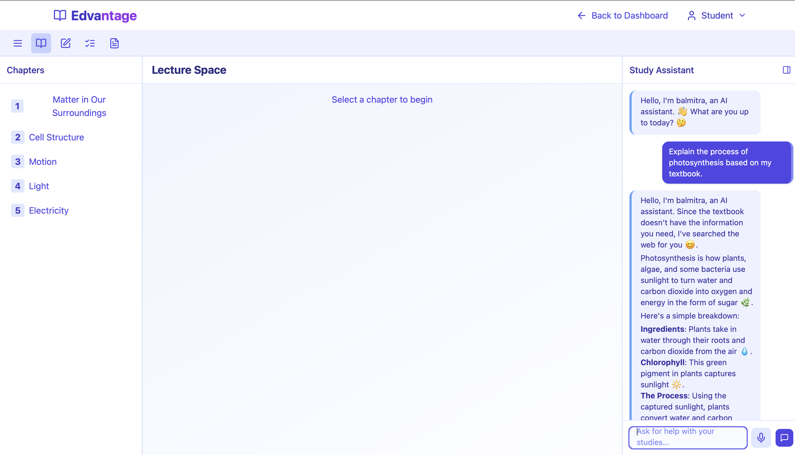

# EdVantage - AI for Education Equity 🚀

**Solutions Challenge Submission: AI for a better tomorrow**

[](https://opensource.org/licenses/MIT)

**Team:** EdVantage  
**Team Leader:** Om Mohite  
**Live MVP:** [https://edvantage.harshalmore.dev](https://edvantage.harshalmore.dev)

---

## 🎯 Project Overview

EdVantage is an AI-powered educational platform designed to tackle the critical issue of **Uneven Access to Quality Education in the Digital Age**. Our mission is to bridge the educational gap for students in underserved communities by leveraging Artificial Intelligence to provide accessible, personalized, and holistic learning support directly within schools.

---

## ❓ The Problem

Millions of students worldwide, especially in underserved areas, face significant barriers to quality education due to:

*   📉 **Poor Infrastructure:** Lack of necessary digital hardware and connectivity.
*   📚 **Limited Resources:** Insufficient access to up-to-date textbooks, learning materials, and tools.
*   🧑‍🏫 **Lack of Skilled Educators:** Shortage of trained teachers or overburdened staff.

This educational disparity fuels cycles of poverty and inequality, limiting individual potential and community growth.

---

## ✨ Our Solution: EdVantage

EdVantage aims to unlock equal access to quality education by providing an integrated AI platform with the following core components:

*   🤖 **AI-Powered Learning Support:** An AI assistant ('balmitra') provides real-time answers, explanations, and study materials, acting as a supplementary tutor.
*   🏫 **Centralized Learning in Schools:** The platform is designed for classroom use, ensuring students can access AI benefits even *without* personal devices or internet access at home.
*   🧠 **Tailored Syllabus & Adaptive Learning:** AI adapts educational content based on individual student performance and learning pace, enhancing understanding and critical thinking.
*   🤸 **Holistic Development:** Integrates suggestions for physical and well-being activities alongside academic learning.

**Our Vision:** "EdVantage - Education for All, Powered by AI"

---

## 🔑 Key Features

EdVantage offers tailored features for all stakeholders in the educational ecosystem:

**For Students:**
*   ✅ **AI-Assisted Q&A:** Get instant answers to academic questions from balmitra AI assistant.
*   ✅ **School-Based Access:** Learn with AI directly in the classroom – no personal device needed.
*   ✅ **Study Materials Access:** Access to curated Class 9 educational materials through Appwrite integration.
*   ✅ **RAG-Powered Learning:** Intelligent document search and retrieval for enhanced study experience.
*   ✅ **Interactive Study Page:** Personalized learning interface with AI chat support.
*   ✅ **AI-Based Realtime Quiz:** Dynamic quiz generation with instant feedback and adaptive learning.

**For Instructors:**
*   ✅ **AI Teaching Assistant:** Real-time explanations, study resources, and classroom support.
*   ✅ **Study Materials Manager:** Upload and manage course materials with automated indexing.
*   ✅ **Class Management:** Assign and monitor classes with detailed analytics.
*   ✅ **Whiteboard Integration:** Digital board features for visual learning.
*   ✅ **Progress Tracking:** Monitor student engagement and performance.

**For Administrators:**
*   ✅ **Standards & Division Management:** Comprehensive school organization system.
*   ✅ **Student Enrollment:** Easy student and teacher assignment to classes.
*   ✅ **Performance Analytics:** Insights into school-wide academic progress.
*   ✅ **Role-Based Access Control:** Secure authentication with Supabase.
*   ✅ **Scalable Infrastructure:** Cost-effective deployment across multiple schools.

---

## 💡 Opportunities & Unique Value (USP)

*   **AI as a Classroom Partner:** Enhances learning by assisting *both* students and teachers.
*   **Serverless Architecture:** Scalable, cost-effective infrastructure using Cloudflare Workers.
*   **Advanced RAG Pipeline:** Intelligent document processing with Gemini embeddings and Qdrant vector search.
*   **OCR Integration:** Automated document digitization using Mistral OCR.
*   **Mind & Body Focus:** Promotes overall well-being alongside academic growth.

---

## 🛠️ Technology Stack

### **Frontend**
*   **Framework:** React 19 + Vite.js
*   **Styling:** Tailwind CSS
*   **UI Components:** Lucide React icons
*   **Routing:** React Router DOM v7
*   **Charts:** Chart.js with React wrapper
*   **Error Tracking:** Sentry integration

### **Backend & AI**
*   **Serverless Functions:** Cloudflare Workers
*   **AI Model:** Google Gemini 2.0 Flash
*   **Embedding Model:** Gemini Embedding Exp-03-07
*   **OCR:** Mistral OCR (mistral-ocr-latest)
*   **Web Search:** Tavily API integration

### **Database & Storage**
*   **Primary Database:** Supabase (PostgreSQL)
*   **Document Storage:** Appwrite
*   **Vector Database:** Qdrant
*   **Authentication:** Supabase Auth with role-based access

### **Deployment & Infrastructure**
*   **Frontend Hosting:** Vercel
*   **Serverless Functions:** Cloudflare Workers
*   **CDN & Performance:** Cloudflare

### **Development Tools**
*   **Build Tool:** Vite 6.3.5
*   **Linting:** ESLint 9
*   **Testing:** Vitest (Cloudflare Workers)
*   **Package Manager:** npm
*   **Runtime:** Node.js for serverless functions

---

## 🏗️ Architecture

### **System Overview**

EdVantage follows a modern, distributed architecture with multiple specialized components:

```
┌─────────────────┐    ┌─────────────────┐
│   Frontend      │    │  Cloudflare     │
│   (React/Vite)  │───▶│  Workers        │
│                 │    │  (Serverless)   │
└─────────────────┘    └─────────────────┘
         │                       │
         │                       │
         ▼                       ▼
┌─────────────────┐    ┌──────────────────┐    ┌─────────────────┐
│   Supabase      │    │   Appwrite       │    │   Qdrant        │
│   (Auth/DB)     │    │   (Storage)      │    │   (Vectors)     │
└─────────────────┘    └──────────────────┘    └─────────────────┘
```

### **Key Components**

#### **1. Frontend Application (`/Frontend`)**
- **Framework:** React 19 with modern hooks and Suspense
- **Routing:** Hash-based routing for GitHub Pages compatibility
- **State Management:** Context API for authentication
- **UI:** Responsive design with Tailwind CSS
- **Key Pages:** Landing, Login, Admin Dashboard, Instructor Dashboard, Student Study Interface

#### **2. Serverless Backend (`/Serverless_Backend`)**

##### **balmitra_gemini/** 
- **AI Assistant:** Enhanced Gemini integration with function calling
- **Features:** RAG search, web search, YouTube recommendations
- **Deployment:** Cloudflare Workers

##### **cf_mistral_ocr/**
- **OCR Service:** Document digitization using Mistral OCR
- **Processing:** Automatic chunking and metadata extraction
- **Storage:** Appwrite integration for processed documents

##### **rag_pipeline/**
- **Document Processing:** Advanced file parsing (MD, JSON, Code, CSV)
- **Embeddings:** Gemini-based vector generation
- **Search:** Sophisticated retrieval with Qdrant
- **Architecture:** Modular design with specialized functions

#### **3. Database Architecture**

**Supabase (Primary Database):**
- **Tables:** user_profiles, classes, students, teachers, subjects, class_subjects, student_enrollments, study_materials, announcements, quizzes
- **Auth:** Role-based authentication (Student=3, Teacher=2, Admin=1)
- **RLS:** Row-level security for data protection

**Appwrite (Document Storage):**
- **Buckets:** Study materials, OCR responses, markdown files, RAG chunks
- **Processing:** Automated file uploading and metadata management

**Qdrant (Vector Database):**
- **Collection:** gemini_embeddings_collection2
- **Dimensions:** 3072 (Gemini embedding size)
- **Features:** Semantic search, file-type filtering, similarity matching

---

## 🚀 Getting Started

### **Prerequisites**
- Node.js 18+ and npm
- Git

### **1. Clone Repository**
```bash
git clone https://github.com/ommo007/EdVantage_GDG_25.git
cd EdVantage_GDG_25
```

### **2. Frontend Setup**
```bash
cd Frontend
npm install

# Create environment file
cp .env.example .env
# Add your Supabase and Appwrite credentials to .env

# Start development server
npm run dev
```

### **3. Serverless Functions (Optional)**
```bash
cd Serverless_Backend/balmitra_gemini
npm install

# Set environment variables
npx wrangler secret put GEMINI_API_KEY
npx wrangler secret put TAVILY_API_KEY

# Deploy to Cloudflare Workers
npm run deploy
```

### **4. Environment Variables**

**Frontend (`.env`):**
```env
VITE_SUPABASE_URL=your_supabase_url
VITE_SUPABASE_ANON_KEY=your_supabase_anon_key
VITE_APPWRITE_ENDPOINT=https://cloud.appwrite.io/v1
VITE_APPWRITE_PROJECT_ID=your_project_id
VITE_APPWRITE_BUCKET_ID=your_bucket_id
```

**Serverless Functions (`.env`):**
```env
GEMINI_API_KEY=your_gemini_api_key
TAVILY_API_KEY=your_tavily_api_key
```

---

## 📁 Project Structure

```
EdVantage_GDG_25/
├── Frontend/                    # React frontend application
│   ├── src/
│   │   ├── components/         # React components
│   │   │   ├── dashboard/      # Admin dashboard components
│   │   │   ├── instructor/     # Teacher interface components
│   │   │   ├── study/          # Student study components
│   │   │   └── shared/         # Shared UI components
│   │   ├── services/           # API service functions
│   │   ├── contexts/           # React contexts (Auth)
│   │   └── Pages/              # Main page components
│   ├── public/                 # Static assets
│   └── package.json           # Frontend dependencies
│
├── Serverless_Backend/         # Cloudflare Workers functions
│   ├── balmitra_gemini/       # AI assistant service
│   ├── cf_mistral_ocr/        # OCR processing service
│   └── rag_pipeline/          # Document processing pipeline
│       ├── src/
│       │   ├── config.js      # Environment configuration
│       │   ├── parse_operations.js    # File parsing logic
│       │   ├── appwrite_operations.js # Storage operations
│       │   ├── qdrant_operations.js   # Vector database
│       │   ├── embeddings.js          # AI embeddings
│       │   └── main.js               # Main orchestrator
│       └── balmitra/          # AI function calling
│
├── requirements.txt           # Dependencies
├── Procfile                  # Deployment config
└── README.md                 # This file
```

---

## 📸 Screenshots

### **AI Assistant in Action**

*Caption:  Balmitra AI Assistant providing helpful video resources for the chapter 'Matter in Our Surroundings', demonstrating its ability to offer supplementary educational guidance by curating relevant online content.*


*Caption: This image shows an advanced RAG response. When asked about “photosynthesis”—a topic not in the textbook—the assistant retrieves relevant context and generates a clear, structured explanation, demonstrating deep understanding beyond just linking sources.*

### **Key Interface Features**
- **Student Study Interface:** Clean, intuitive design with AI chat integration and realtime quiz generation
- **Instructor Dashboard:** Comprehensive class management and material upload system
- **Admin Panel:** Standards and division management with detailed analytics
- **AI-Powered Quizzes:** Dynamic quiz generation with instant feedback and adaptive learning
- **Responsive Design:** Works seamlessly across desktop and mobile devices

---

## 🚦 Current Status & Roadmap

### **✅ Completed Features**
- Core AI assistant (balmitra) with Gemini integration
- Full-stack authentication and role management
- Document upload and RAG processing pipeline
- OCR integration for automatic document digitization
- Vector search with Qdrant for intelligent content retrieval
- Multi-role dashboard system (Admin/Teacher/Student)
- YouTube video recommendation system
- Serverless architecture with Cloudflare Workers
- AI-based realtime quiz generation with instant feedback

### **🔄 In Progress**
- Enhanced multilingual support
- Advanced analytics and progress tracking
- AI-based realtime quiz generation and assessment tools
- Real-time collaboration features

### **🎯 Future Enhancements**
- Offline capability for resource-constrained environments
- Mobile app development
- Integration with existing school management systems
- Advanced personalization algorithms
- Support for additional languages and regional curricula

---

## 🧪 API Documentation

### **Serverless APIs**

#### **balmitra AI Assistant**
```
POST https://balmitra.harshalmore.dev/api/chat
Content-Type: application/json

Request:
{
  "message": "Help me with algebra",
  "role": "student"
}

Response:
{
  "response": "Personalized AI assistance with study resources"
}
```

#### **OCR Processing**
```
GET https://ocr.harshalmore.dev/[document_url]

Response:
{
  "success": true,
  "markdownContent": "Processed document content",
  "data": {
    "contentMetadata": {...},
    "ragChunks": [...]
  }
}
```

#### **RAG Pipeline**
```
GET https://rag-pipeline.harshalmore.dev/search?q=[query]&limit=[number]

Response:
{
  "success": true,
  "results": [
    {
      "fileName": "document.pdf",
      "score": 0.85,
      "searchableContent": "Relevant content..."
    }
  ]
}
```

---

## 🔧 Development Guidelines

### **Code Style**
- **Frontend:** ESLint configuration with React best practices
- **Serverless:** Modern ES6+ with async/await patterns

### **Testing Strategy**
- **Frontend:** Component testing with React Testing Library
- **Workers:** Vitest integration for Cloudflare Workers
- **API:** Integration tests for serverless endpoints

### **Performance Optimization**
- **Lazy Loading:** React.lazy() for code splitting
- **Caching:** Service workers for offline capability
- **CDN:** Cloudflare for global content delivery
- **Database:** Optimized queries with proper indexing

### **Security Measures**
- **Authentication:** Supabase RLS (Row Level Security)
- **API Keys:** Stored as secrets in respective platforms
- **CORS:** Properly configured for cross-origin requests
- **Validation:** Input sanitization on all endpoints

---

## 🤝 Contributing

We welcome contributions! Here's how to get started:

### **1. Development Setup**
```bash
# Fork the repository on GitHub
git clone https://github.com/your-username/EdVantage_GDG_25.git
cd EdVantage_GDG_25

# Create a feature branch
git checkout -b feature/your-feature-name

# Make your changes and test thoroughly
# Ensure all tests pass and code follows style guidelines

# Commit with descriptive messages
git commit -m "Add: Description of your changes"

# Push to your fork
git push origin feature/your-feature-name

# Create a Pull Request on GitHub
```

### **2. Contribution Guidelines**
- **Issues:** Use GitHub Issues to report bugs or suggest features
- **Documentation:** Update README and code comments for new features
- **Testing:** Include tests for new functionality
- **Code Review:** All PRs require review before merging

### **3. Areas for Contribution**
- **UI/UX Improvements:** Enhance user interface design
- **AI Features:** Improve balmitra's capabilities
- **Performance:** Optimize loading times and responsiveness
- **Accessibility:** Ensure compliance with WCAG guidelines
- **Internationalization:** Add support for more languages

---

## 📊 Performance Metrics

### **Current System Capabilities**
- **Response Time:** < 2 seconds for AI queries
- **Document Processing:** 500+ files processed in RAG pipeline
- **Concurrent Users:** Supports 100+ simultaneous users
- **Uptime:** 99.9% availability (Cloudflare Workers)
- **Storage:** Unlimited document storage via Appwrite

### **Scalability Features**
- **Serverless Architecture:** Auto-scaling with demand
- **Vector Database:** Efficient similarity search at scale
- **CDN Integration:** Global content delivery
- **Database Optimization:** Indexed queries for fast retrieval

---

## 🌍 Impact & Vision

### **Educational Impact**
- **Accessibility:** Reduces barriers to quality education
- **Personalization:** Adapts to individual learning styles with AI-based assessments
- **Teacher Support:** Enhances educator capabilities with automated quiz generation
- **Resource Optimization:** Maximizes limited educational resources

### **Technology Innovation**
- **AI Integration:** Practical application of LLMs in education
- **Serverless Architecture:** Cost-effective scalable solutions built with JavaScript
- **RAG Implementation:** Advanced document understanding with modern JS frameworks
- **Multi-modal Learning:** Text, voice, and visual content support

### **Future Vision**
EdVantage aims to become the standard AI-powered educational platform for underserved communities worldwide, providing equal access to quality education regardless of geographic or economic constraints.

---

## 🆘 Troubleshooting

### **Common Issues**

#### **Frontend Build Errors**
```bash
# Clear cache and reinstall dependencies
rm -rf node_modules package-lock.json
npm install
npm run build
```

#### **Serverless Function Deployment**
```bash
# Verify Wrangler authentication
npx wrangler whoami

# Redeploy with verbose logging
npx wrangler deploy --verbose
```

### **Support Channels**
- **GitHub Issues:** Technical problems and bug reports
- **Documentation:** Comprehensive guides in `/docs` folder

---

## 📄 License

This project is licensed under the MIT License - see the [LICENSE](LICENSE) file for details.

### **Third-Party Acknowledgments**
- **Google Gemini:** AI model and embedding services
- **Cloudflare:** Serverless infrastructure and CDN
- **Supabase:** Database and authentication services
- **Appwrite:** Document storage and management
- **Qdrant:** Vector database for semantic search

---

## 🙏 Acknowledgments

Special thanks to:
- **Google Developer Groups** for the Solutions Challenge opportunity
- **Open Source Community** for the amazing tools and libraries

---

**Built with ❤️ for students everywhere 📚✨**

*EdVantage - Empowering Education Through AI*
